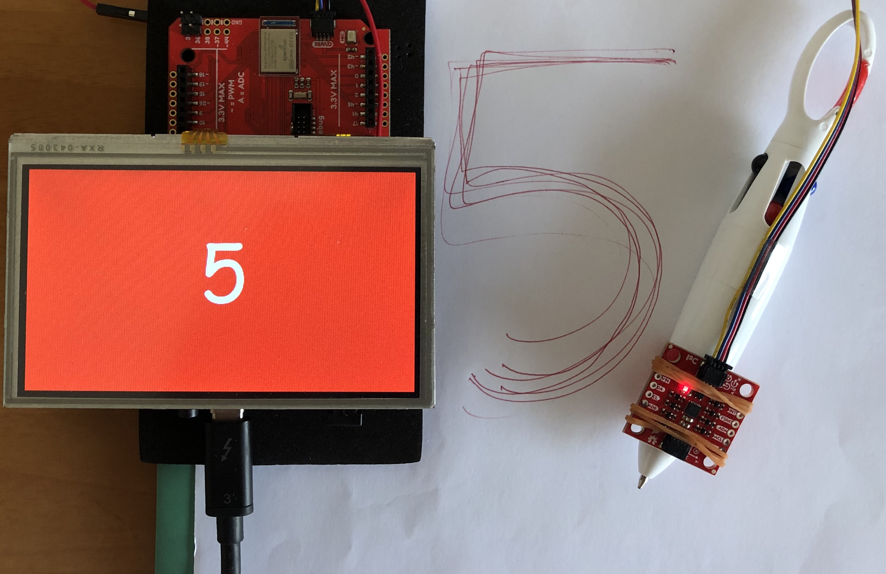
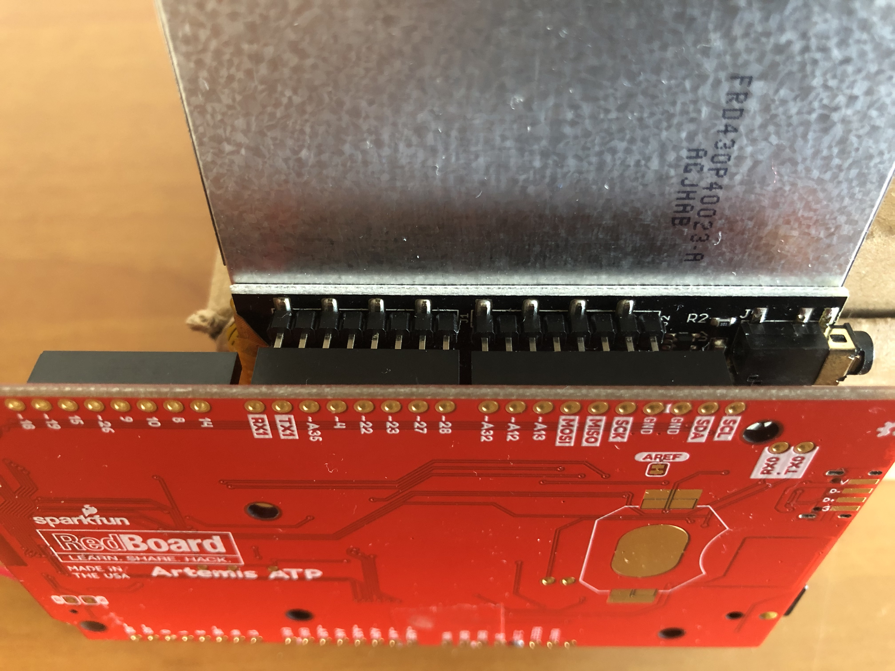
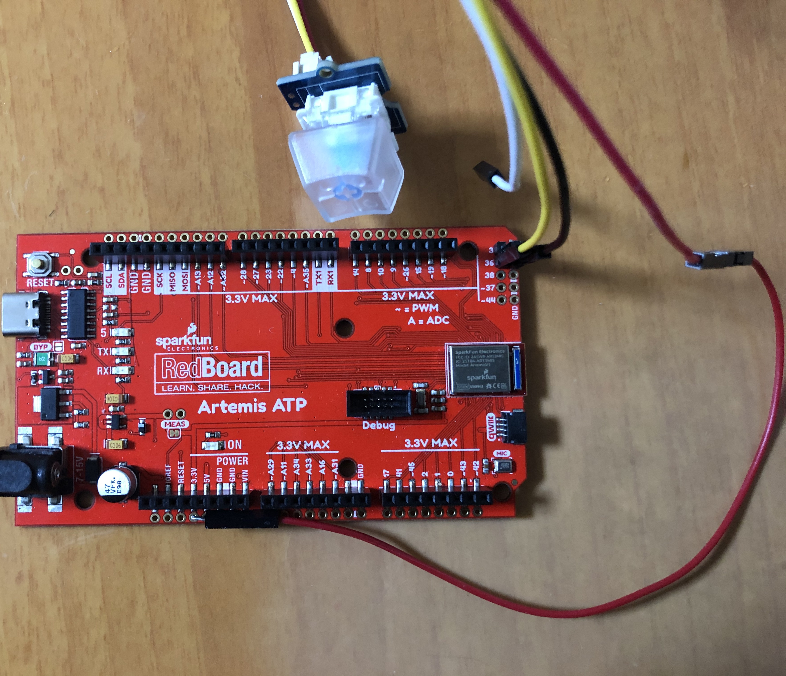
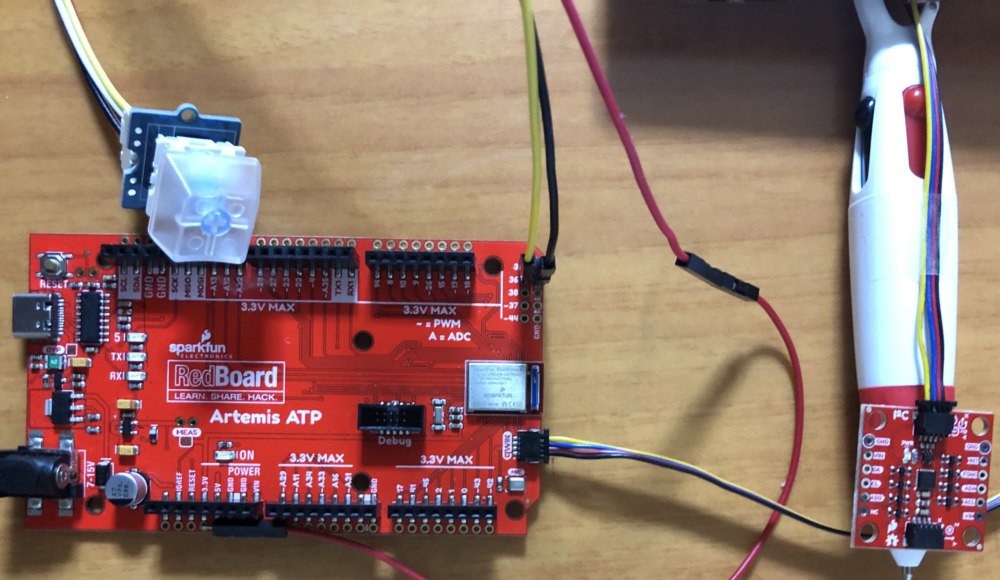

# Handwriting Recognition
In this project, I build a pen device which can be used to recognize handwritten numerals. As its input, it takes multidimensional accelerometer and gyroscope sensor data. Its output will be a simple classification that notifies us if one of several classes of movements, in this case 0 to 9 digit, has recently occurred.

## Required Hardware Components
1. [Sparkfun Artemis ATP](https://www.sparkfun.com/products/15442)
2. [SparkFun 9DoF IMU Breakout - ICM-20948 (Qwiic)](https://www.sparkfun.com/products/15335)
3. [SparkFun Qwiic Cable - 500mm](https://www.sparkfun.com/products/14429)
4. [Seeed Grove - Mech Keycap](https://www.seeedstudio.com/Grove-Mech-Keycap.html)
5. [Gameduino 3](https://excamera.com/sphinx/gameduino3/index.html)
6. Micro SD card

## Required Softwares and Libraries
1. [Arduino IDE 1.8.12](https://www.arduino.cc/en/Main/Software)
2. [TensorFlow 2.1](https://www.tensorflow.org/install)
3. [SparkFun_ICM-20948_ArduinoLibrary](https://github.com/metanav/SparkFun_ICM-20948_ArduinoLibrary) (A forked repo of the original library with FIFO implementation)
4. [Jupyter](https://jupyter.org/install)
5. [Gameduino 3 library](https://excamera.com/sphinx/gameduino2/code.html)

Please see the links above for downloading and installation instructions.
Please see the instructions [here](https://learn.sparkfun.com/tutorials/artemis-development-with-arduino) to setup Artemis ATP board with Arduino IDE.

## Configure Gameduino Library to work with Artemis ATP
The Gameduino 3 does not work out of the box with Artemis ATP. We need to do few adjustments in the Gameduino library.
Please download Gameduino2.zip from https://github.com/metanav/gd2-lib.
Also, we need to add pin definition for A32, please see the pull request https://github.com/sparkfun/Arduino_Apollo3/pull/129.
To connect the Gameduino 3 shield, align the longer header pins on the shield to the Artemis ATP RX1->TX1 ... GND->GND as shown in the image below.

## Data Collection
We need to connect Grove Mech Keycap (mechenical switch) to the Artemis ATP. It is connected to the 3V, GND and digital pin 36. Since Gameduino 3 shield covers all the power pins of Artemis ATP, we need to solder wires to the secondary rail of plated through-holes as shown below.

The SparkFun 9DoF IMU Breakout-ICM-20948 (attached to a pen) is connected to the Artemis ATP Qwiic connector using a long 500mm SparkFun Qwiic cable.

Use [data_collection.ino](https://github.com/metanav/Handwriting_Recognition_IMU/tree/master/sketches/data_collection) in the sketches directory to collect data from the IMU sensor.

## Training
Use [train.ipynb](https://github.com/metanav/Handwriting_Recognition_IMU/blob/master/train.ipynb) to train the model.
You can use a GPU or CPU to train.

## Inferencing
Use [handwriting_recognizer.ino](https://github.com/metanav/Handwriting_Recognition_IMU/tree/master/sketches/handwriting_recognizer) to recognize handwritten numerals from the data coming from IMU sensor motion.

